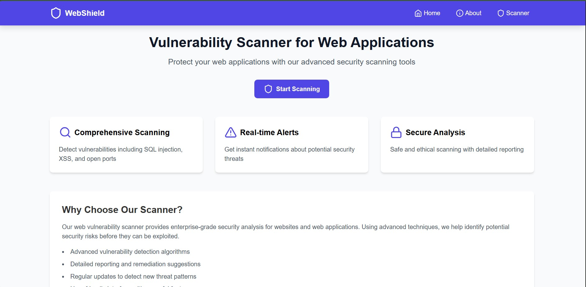
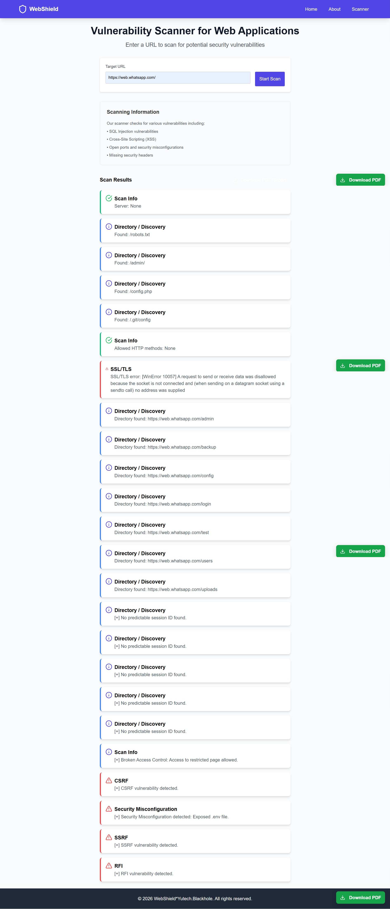

# Web-Sheild

[](https://www.python.org/downloads/)
[](https://flask.palletsprojects.com/)
[](LICENSE)
[](https://github.com/astral-sh/uv)

## 📋 Project Description

`Web-Sheild` is a lightweight web vulnerability scanner that performs common security checks and generates PDF reports. It is intended for authorized testing and educational use.

### Key Functionalities
- Nikto-style common file and header checks
- Basic SQL Injection and XSS testing
- Broken authentication and access control checks
- CSRF, SSRF and RFI probes
- Sensitive data and TLS checks
- PDF export of scan results

---

## 🛠 Quick Start

Minimal commands to run locally:

```bash
pip install -r code/requirements.txt
python code/scanner.py
```

Open: http://127.0.0.1:5000

---

## 🖼 Screenshots

Home / Scanner view:



Report / PDF preview:



---

## Project Structure (short)

```
code/
  ├─ scanner.py
  ├─ requirements.txt
  └─ static/
assets/
README.md
LICENSE
```

---

## Notes
- Uses Flask development server for convenience. Use a WSGI server for production.
- Only scan targets you are authorized to test.

Last updated: February 27, 2026
### Issue: False positives in results
**Solution:**
- Some results may be false positives due to signature-based detection
- Always manually verify findings on the actual target
- Use additional security tools for confirmation
- Review error messages carefully (prefixed with `[-]`)

### Issue: PDF report download fails
**Solution:**
- Ensure ReportLab is installed: `pip install reportlab`
- Check browser's download settings
- Verify adequate disk space
- Try in a different browser

## 📚 References

- [OWASP Top 10](https://owasp.org/www-project-top-ten/) - Most critical web application security risks
- [OWASP Testing Guide](https://owasp.org/www-project-web-security-testing-guide/) - Comprehensive security testing methodology
- [Flask Documentation](https://flask.palletsprojects.com/) - Flask framework reference
- [Requests Library](https://requests.readthedocs.io/) - HTTP library documentation
- [OWASP API Security](https://owasp.org/www-project-api-security/) - API-specific security guidance
- [CWE/SANS Top 25](https://cwe.mitre.org/top25/) - Software weakness rankings

## � Tech Stack

- **Backend:** Python 3.10+, Flask 2.3, Flask-CORS
- **HTTP:** requests
- **Reporting:** ReportLab (PDF)
- **Frontend:** Jinja2 templates, static HTML/CSS
- **Package Manager:** `uv` (optional)
- **Testing:** pytest (optional)


## 👥 Authors & Contact

- **Yash Paraskar** — yashparaskar2@gmail.com
- **GitHub:** https://github.com/Yash010111
- **Issues / Support:** https://github.com/Yash010111/Web-Sheild/issues


## �📄 License

This project is provided as-is for educational and authorized testing purposes. See [LICENSE](LICENSE) file for details.

## 👨‍💻 Contributing

Contributions are welcome! To contribute:

1. **Fork the repository**
2. **Create a feature branch**: `git checkout -b feature/new-feature`
3. **Make your changes** and test thoroughly
4. **Follow existing code style** and conventions
5. **Add appropriate error handling** for reliability
6. **Update documentation** if adding new features
7. **Submit a pull request** with a clear description

### Development Guidelines

- Maintain code readability and consistency
- Add docstrings to new functions
- Test changes on multiple URLs
- Ensure no hardcoded paths or credentials
- Handle exceptions gracefully
- Follow Flask and Python best practices

## 🔒 Security Disclaimer

**This tool is provided strictly for authorized security testing and educational purposes.**

- **Unauthorized access** to computer systems without permission is illegal
- The authors are **not responsible** for misuse or illegal activity
- Always obtain **written permission** before testing any system
- Understand and follow **all applicable laws and regulations**
- Use responsibly and ethically

---

**Last Updated**: February 2026  
**Developed for**: Educational and Authorized Penetration Testing
